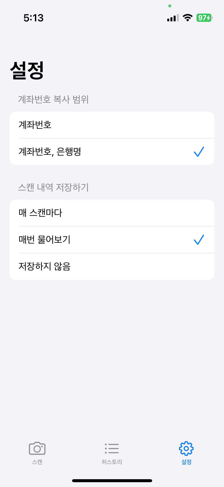

# 개발 배경
- 자취를 시작하며 시장을 자주 가게 되었는데, 요즘 시장은 현금이 아닌 계좌 이체를 받는다. 계좌번호를 대충 적어두시는 곳이 많은데, 매번 보고 계좌를 입력하는 것이 귀찮아서 계좌번호를 인식하는 앱이 있었으면 좋겠다고 생각하여 개발

# 기능
- 사진을 찍어서 계좌번호에 해당하는 번호만 인식
- 스캔한 계좌 번호들을 저장
- 저장된 계좌번호의 관리

# 기술스택
- Swift
- UIKit
- CoreData
- Vision, VisionKit

# 배운 것
- 처음으로 만들어본 iOS 앱으로 기본적인 앱 개발의 기본기를 배울 수 있었다.
- UI 데이터 바인딩의 필요성을 알게 되어 커스텀 Observable 패턴 적용
- VisionKit TextRecognition
- 기본 카메라 기능이 아닌 AVFoundation을 통한 커스텀 카메라

# ScreenShot

